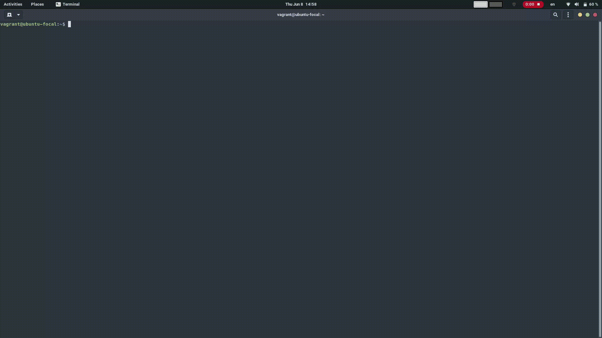
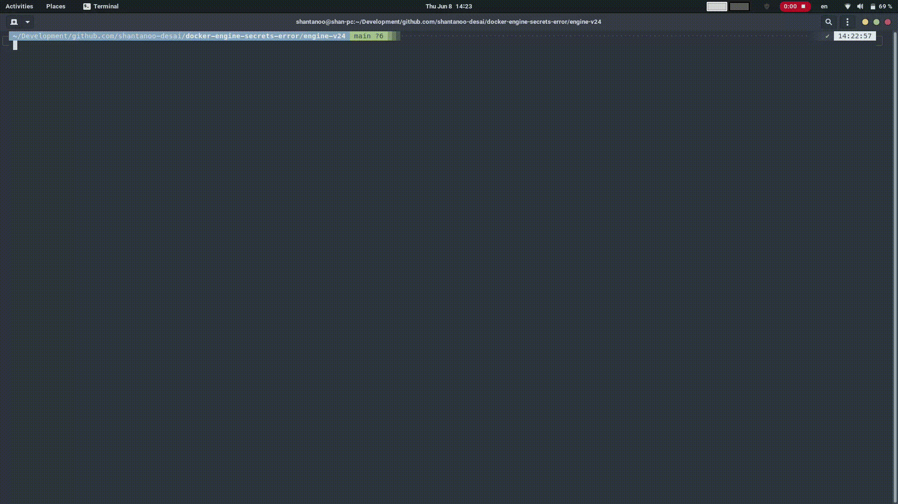

# Docker Engine Discrepancy with Docker Compose Secrets

This repository shows a mismatch of how Docker Secrets set via 
Environment Variable:

> Works with Docker Engine v23.x with most Docker Compose v2 plugins

> DOES not work with Docker Engine v24.x with most Docker Compose v2 plugins

This repository is meant to address [Docker Compose Issue 10663][1].

## Environment

### Host Machine

```bash
NAME="Manjaro Linux"
PRETTY_NAME="Manjaro Linux"
ID=manjaro
ID_LIKE=arch
BUILD_ID=rolling
ANSI_COLOR="32;1;24;144;200"
HOME_URL="https://manjaro.org/"
DOCUMENTATION_URL="https://wiki.manjaro.org/"
SUPPORT_URL="https://forum.manjaro.org/"
BUG_REPORT_URL="https://docs.manjaro.org/reporting-bugs/"
PRIVACY_POLICY_URL="https://manjaro.org/privacy-policy/"
LOGO=manjarolinux
```

### Vagrant Version

used to spin up isolated Environments (VMs) using Virtual Box

    Installed Version: 2.3.4

Virtual Box version:

    7.0.8 r156879

### Ansible Version

used to provision Vagrant Boxes with Docker Engine / Docker Compose software

    ansible [core 2.15.0]

## Setup

In both Vagrant boxes we will install the following Docker Compose versions:

| Compose Version | Binary in Vagrant Box |
|:----------------|:----------------------|
| __v2.16.0__     | `docker-compose-v2.16.0` |
| __v2.17.3__     | `docker-compose-v2.17.3` |
| __v2.18.1__     | `docker-compose-v2.18.1` |

### Docker Engine v23.x

| Software | Version |
|:---------|:--------|
| `containerd.io` | 1.6.9  |
| `docker-ce-cli` | 23.0.6 |
| `docker-ce`     | 23.0.6 |
| `docker-buildx-plugin` | 0.10.4 |

### Docker Engine v24.x

| Software | Version |
|:---------|:--------|
| `containerd.io` | 1.6.21 |
| `docker-ce-cli` | 24.0.2 |
| `docker-ce`     | 24.0.2 |
| `docker-buildx-plugin` | 0.10.4 |

## Steps

### Docker Engine v23.x

1. Bring the Box up and log in:

    ```bash
    $ cd engine-v23
    $ vagrant up
    $ vagrant ssh
    ```
2. In the box:

    ```bash
    $ cd /vagrant
    $ FOO=hello docker-compose-v2.16.0 run demo cat /run/secrets/foo
    $ FOO=hello docker-compose-v2.17.3 run demo cat /run/secrets/foo
    $ FOO=hello docker-compose-v2.18.1 run demo cat /run/secrets/foo
    ```

### Docker Engine v24.x

1. Bring the Box up and log in:

    ```bash
    $ cd engine-v24
    $ vagrant up
    $ vagrant ssh
    ```
2. In the box:

    ```bash
    $ cd /vagrant
    $ FOO=hello docker-compose-v2.16.0 run demo cat /run/secrets/foo
    $ FOO=hello docker-compose-v2.17.3 run demo cat /run/secrets/foo
    $ FOO=hello docker-compose-v2.18.1 run demo cat /run/secrets/foo
    ```

## Results

### Docker Engine v23.x



### Docker Engine v24.x




[1]: https://github.com/docker/compose/issues/10663

